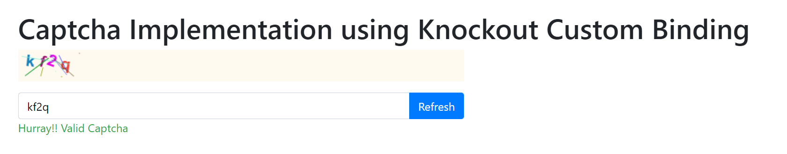

# Implement Captcha using knockout-typescript

1. Captcha-Jquery lib
2. Knockout custom binding for captcha
3. Integrate Captcha Component in your project

To run this example, execute the following commands:

```
npm install
npm run serve
```

## Demo



## Show me some code

Configure Captcha and define isCaptchaValid() and refreshCaptcha() function

```javascript
import * as ko from 'knockout';
import { BindingHandler, ObservableArray } from 'knockout';
import Captcha from '../../external/jquery-captcha';

const captchaBinding = {
    init: (elm: any, va: () => any, all: () => any, vm: any) => {

        const cmp: any = va();
        const cp = new Captcha(elm, cmp.captchaConfig);

        cmp.isCaptchaValid = () => {
            const isValid = cp.valid(cmp.captchaInput());
            // Refresh captcha if its not valid
            if (!isValid) {
                cp.refresh();
                cmp.captchaInput('');
            }
            return isValid;
        }

        cmp.refreshCaptcha = () => {
            cp.refresh();
            cmp.captchaInput('');
            cmp.clearError();
        }
    }

}as BindingHandler;

export default captchaBinding;
```

Captcha component which uses captcha binding

```javascript
class CaptchaComponent  {
        captchaInput: Observable<string>;
        disableFields: Observable<boolean>;
        showSuccessMsg: Observable<boolean>;
        captchaConfig: any;
        isCaptchaValid: (() => boolean) | undefined;
        refreshCaptcha!: () => void;

        constructor(params: any) {
            this.disableFields = params.disable;
            this.captchaConfig= params.config? params.config :{
                width: 100,
                height: 40,
                font: 'bold 23px Arial',
                resourceType: 'aA0@',
                resourceExtra: [],
                caseSensitive: true,
                autoRefresh: false,
                clickRefresh: false
            };
            this.showSuccessMsg = ko.observable(false);
            this.captchaInput = ko.observable('').extend({
                validation: {
                    validator: () => {
                        if (this.isCaptchaValid) {
                            const isValid=this.isCaptchaValid();
                            this.showSuccessMsg(isValid);
                            return isValid;
                        }
                        return false;
                    },
                    message: "Please Enter Valid Captcha",
                }
            });
        }

        refresh() {
            if (this.refreshCaptcha) {
                this.refreshCaptcha();
            }
        }

       clearError(): void {
            let errors = ko.validation.group(this);
            errors.showAllMessages(false);
        }
    }

    export default {
    viewModel: CaptchaComponent,
    template: `
      <div class="form-group" style="background-color: floralwhite">
         <canvas id="canvas" data-bind="captcha: $data" ></canvas>
     </div>
     <div class="form-group">
        <div class="input-group" data-bind="validationOptions:{ insertMessages: false }">
          <input data-bind="value: captchaInput,disable: disableFields" class="form-control" style="color: black" placeholder="Enter Above Text Here And Press Enter" />
          <div class="input-group-append">
              <button class="btn btn-primary"
                     data-bind="click: refresh, disable: disableFields" data-toggle="tooltip" data-placement="top" title="Refresh Captcha">
                  <span>Refresh</span></button>
          </div>
        </div>
        <span class="text-danger" data-bind="validationMessage: captchaInput"></span>
        <span class="text-success" data-bind="visible: showSuccessMsg">Hurray!! Valid Captcha</span>
    </div>
`};
```

Refer External > jquery-captcha.ts file for implementation of captcha

